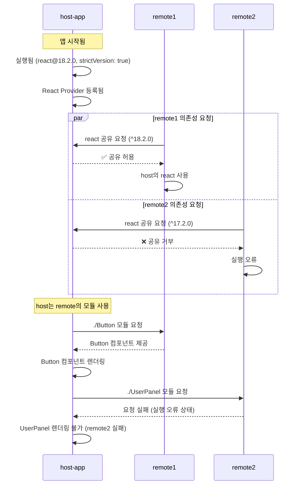

# well-structured-mono-repository.


# 목표

 mono-repository + Module Federation을 올바르고 정확히 구성

# 상세 

수차례 mono-repository + Module Federation구조로 프로젝트를 진행했던 경험을 바탕으로 경험했던 이슈를 개선하고, 더 올바르고 정확한 구조 구성


# 중점내용

- shared로 공유되는 대상들은 어떻게 장기적인 유지보수와 버전 변경에도 문제 없이 대응 할 수 있을것인가
	- 🖍️핵심은 **strictVersion**, **의존성 제공자**, **federation모듈 제공자**🖍️


- ·
	-  ·

		- 의존성 제공자와 federation모듈 제공자는 서로 다른 개념
		
		- exposes와 remotes은 import/export 설정일 뿐( federation모듈 제공 설정)
		
		- 의존성 제공자는 shared 규칙에 따름.
		
		-  host, remote1, remote2들의 shared 선언을 참조하지만, 실제 런타임 실행 시점(최초 로딩된 앱 기준)에 따라 의존성 제공자가 결정됨. 아래의 예시에서 누가 의존성 제공자일지 생각해보자. 
 
```ts
		// host 
		shared: {
		  react: {
		    singleton: true,
		    strictVersion: true, 
		    requiredVersion: '^19.2.0',
		  },	
		// remote1 
		shared: {
		  react: {
		    singleton: true,
		    strictVersion: true,
		    requiredVersion: '^18.2.0',
		  }
		} 

		// remote2 
		shared: {
		  react: {
		    singleton: true,
		    strictVersion: true,
		    requiredVersion: '^17.2.0',
		  }
		}
```
- ·
	-  ·
		- strictVersion : 의존성 제공자의 버전이 100% 정확히 맞지 않으면 의존성 공유 자체를 차단 (빌드타임 에러) 의존 일관성 유지를 위해 사용

		-	host에서 버전을 명시하지 않은 경우 : remote들의 버전 차이가 있어도 대충 공유 → 런타임 충돌 위험
	
		-	host에서 버전을 명시한 경우 : remote들은 host의 버전을 따름.
		    버전을 따르는것과 잘 동작하는것은 다름. 
		-	host에 react 의존성이 명시 되어 있는 경우 (1) , remote1에서 react를 사용해 버튼 컴포넌트를 제공 해도, remote1의 의존성을 사용하지 않고 host의 react버전을 사용함. (수차례 언급하고 있다, 정말 많은 개발자들이 헷갈려 하는부분이라 반복해서 말하는것. 다시한먼 강조하지만 의존성 제공자와 federation제공자는 완전히 다른시점에, 다른 동작원리로 동작한다. )
		
- 🟢🟢🟢 Start Of well constructed 🟢🟢🟢
  
이 구조면, **host가 `react` 제공자**,  
**remote는 host로부터 받아서 쓰는 소비자**가 돼서  단일 인스턴스 유지 + 안정적 공유 가능

```ts
// (1) host-app 
shared: {
  react: {
    singleton: true, // 공유되는 모든 react의 인스턴스는 하나임을 선언
    strictVersion: true, // 버전이 정확히 맞지 않으면 공유 자체를 차단 (빌드타임 에러)
    requiredVersion: '^18.2.0', // 버전 명시
  },	
  'react-dom': {
    singleton: true,
    requiredVersion: '^18.2.0',
  },
}


```

```ts
// remote1
shared: {
  react: {
    singleton: true,
    requiredVersion: '^18.2.0',
  },
  'react-dom': {
    singleton: true,
    requiredVersion: '^18.2.0',
  },
}
```
- 🟢🟢🟢 End Of well constructed 🟢🟢🟢
 
- Hot Reload, HMR은 어떻게 구성할 것인가.
  - watcher
  - HMR 
- host, remotes간 타입추론은 어떻게 공유할것인가
	- 제공자의 타입 전달
	- 소비자의 타입 추론
- 어떻게/얼만큼 분리할것인가.
	- 단일프레임워크, 다중 프레임워크 중 뭘로 구성해야 할까
	- federation대상의 분해 단위(컴포넌트?화면?)는 얼마만큼이 적당할까
	- 호스트는 어떤 프레임워크로 사용해야 할까

 - 다중 프레임워크 구조는 꼭 필요한가
   - **첫 federation 구성이라면 하지마세요**
     
     - 의존성 관리와 같은 위 내용들을 보고도 다중 프레임워크를 구성하고 싶은 생각이 드시나요? 위 내용은 정말 많은 이슈중 몇가지 일뿐입니다. 처음엔 동작하는것 처럼 보일 수 있으나 저장소가 거대해질수록 잦은 문제가 발생할거고 관리 포인트가 제곱으로 늘어나게 됩니다.
    곧 무너질 성을 지어놓고 대단한 건축물을 완성했다고 착각하며 무용담을 떠들 목적으로 구성하는것이라면 강력히 하지말라고 권장 드립니다. 시스템은 어떤 이유에서든 필연적으로 덕지덕지 붙게 되어 있고, 언젠가 한번은 바보들이 관리하게 되어 있어요. 나이스한 개발리더가 없어도, 감독자가 없어도 시스템이 의도된 강제성으로 이상한 흐름으로 가는것 막을 수 있어야해요. 특히나 다수의 개발자가 관리하는 mono-reppsitory의 경우 더더욱 의도적 제한이 필요합니다. 하나의 프레임워크의 federation 결합도 예측하기 어려운데 멀티프레임워크로 구성하고 문제 없이 잘 동작 할 수 있나요? 당신이 떠나고 동료나 후배들이 당신에 철학을 잘 이어나갈 수 있게 구성할 수 있나요?  
	
   - **그래도 굳이 굳이 해야하는 상황이라면**
     - 다중 프레임워크를 구성할때 고려 해야할 것들은 무엇일까
     - 다중 프레임워크간 상태를 어떻게 공유할까
     - 다중 프레임워크 사용 시 반응성을 어떻게 유지할까
- EOL은 얼마로 예상해야 하는가
- monorepo의 거대함의 정도는 얼마로 제한해야 하는가
- 런타임 통합과 빌드타임 통합은 어떤 기준으로 구분 되어야 할까  
